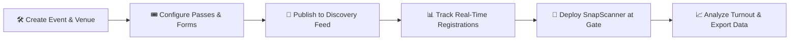
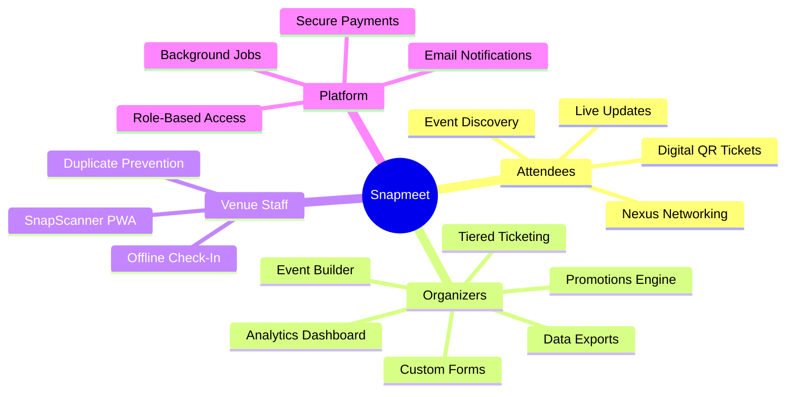

  

<h1 align="center">Snapmeet</h1>

  <strong>Next-generation event management, ticketing, and attendee experience platform.</strong>

  Discover events &nbsp;·&nbsp; Organize experiences &nbsp;·&nbsp; Bring people together

  <a href="https://snapmeet.co.in">Website</a>
  &nbsp;•&nbsp;
  <a href="https://snapmeet.co.in/events/">Browse Events</a>
  &nbsp;•&nbsp;
  <a href="https://snapmeet.co.in/about/">About Us</a>
  &nbsp;•&nbsp;
  <a href="https://snapmeet.co.in/support/">Support Center</a>

  
  
  
  

---

## 🌟 About Snapmeet

**Snapmeet** is an end-to-end event management and ticketing platform designed to simplify how events are **organized, discovered, and experienced**. Built for community organizers, academic institutions, conference hosts, creative collectives, and event-driven organizations, Snapmeet brings organizers and attendees together through a unified, frictionless digital experience.

From customizable multi-tier ticketing and dynamic registration forms to AI-assisted attendee networking and offline-ready gate check-in, Snapmeet delivers the operational tools needed to run seamless **in-person, virtual, and hybrid events** at any scale.

---

## ✨ What You Can Do

### 🎟️ For Attendees & Participants

| Capability | Description |
|---|---|
| **Discover & Explore** | Browse curated local and national events — college fests, hackathons, conferences, cultural gatherings — with smart category, date, and location filtering. |
| **Frictionless Registration** | Complete streamlined registration flows with custom form inputs, multi-ticket selections, and instant order confirmation. |
| **Digital QR Passes** | Receive cryptographically verifiable, branded digital tickets delivered instantly to your inbox. |
| **Smart Networking (Nexus)** | Connect with peers, speakers, and mentors through **Nexus**, an intelligent matchmaking service that aligns participants by professional goals and shared interests. |
| **Real-Time Updates** | Access live event schedules, announcements, venue maps, and entry instructions directly from your attendee portal. |

---

### 🎪 For Event Organizers

| Capability | Description |
|---|---|
| **Intuitive Event Builder** | Launch events in minutes with an integrated wizard covering agendas, custom venues, media banners, and SEO metadata. |
| **Dynamic Registration Forms** | Build custom attendee experiences with conditional fields, questionnaires, file uploads, and team registration support. |
| **Tiered Ticketing** | Define multiple ticket categories — General, Early Bird, VIP, Student Pass — with granular capacity quotas and scheduling windows. |
| **Organization & Fest Portals** | Group sub-events, competitions, and tracks under a unified branded hub for campuses and multi-track conferences. |
| **Promotions & Coupons** | Configure targeted discount codes with custom deduction types, expiration policies, and usage limits. |
| **Live Analytics** | Monitor real-time registration velocity, ticket distribution, attendee demographics, and financial summaries from a single dashboard. |
| **Attendee Exports** | Download structured attendee rosters and check-in logs for venue logistics and coordination. |

---

### ⚡ For Gate Operations & Venue Staff

| Capability | Description |
|---|---|
| **SnapScanner Gate App** | A mobile-first Progressive Web App (PWA) enabling staff to validate entry tickets with sub-second camera scanning. |
| **Offline-First Resilience** | Pre-loads event rosters to maintain full check-in capability even in venues with limited or no network connectivity, syncing automatically when reconnected. |
| **Duplicate Prevention** | Instantly identifies already scanned, counterfeit, or invalid passes to prevent unauthorized venue entry. |

---

## 🔄 How Snapmeet Works

### The Attendee Journey

### The Organizer Journey

---

## 🧩 Platform Capabilities at a Glance

---

## 🛠️ Built With

Snapmeet is engineered as a modern, high-concurrency platform prioritizing performance, data integrity, and operational resilience.

| Layer | Technology |
|---|---|
| **Core Platform** | Python & Django — Modular Monolith Architecture |
| **User Interface** | Semantic HTML5, Modern Vanilla JavaScript, Responsive CSS |
| **Gate Scanner App** | Progressive Web App (PWA) with Offline Storage (IndexedDB) |
| **Data Persistence** | Enterprise Relational Database (PostgreSQL) |
| **Caching & Task Queue** | Redis In-Memory Cache & Distributed Task Queue (Celery) |
| **Digital Ticketing** | Cryptographically signed PDF tickets with dynamic QR encoding |
| **Intelligence Layer** | Context-aware attendee networking algorithms (Nexus) |
| **Security & Compliance** | Strict CSRF controls, encrypted sensitive fields, RBAC, parameterized queries |
| **Media Storage** | Cloud-hosted media asset delivery |

---

## 🚀 Getting Started

### For Event Organizers

1. Visit [snapmeet.co.in](https://snapmeet.co.in) and create your organizer account.
2. Navigate to **Host an Event** to open the event creation wizard.
3. Configure your ticket tiers, customize your registration form, and publish your event.
4. Access your **Organizer Dashboard** to track live ticket sales and export attendee data.
5. Download the **SnapScanner** gate app on any mobile device for day-of-event check-in.

### For Attendees

1. Browse events at [snapmeet.co.in/events](https://snapmeet.co.in/events/).
2. Select your ticket tier and complete the registration form.
3. Receive your digital QR pass directly in your inbox.
4. Present your QR pass at the venue for instant gate entry.
5. Use **Nexus** to connect with other attendees before, during, and after the event.

### For Venue Staff

1. Receive the **SnapScanner** link from your event organizer.
2. Open on any smartphone browser — no app store download required.
3. Authenticate with the one-time gate passcode provided by the organizer.
4. Begin scanning attendee QR codes for instant, offline-capable check-in validation.

---

## 🔐 Security & Trust

Security is foundational at Snapmeet, not an afterthought.

- **Authentication**: Secure session management and OAuth social login with account-takeover protections.
- **Data Encryption**: Sensitive fields are encrypted at rest using industry-standard encryption.
- **Access Control**: Role-based access control (RBAC) for organizers, attendees, gate staff, and administrators.
- **Payment Safety**: All payment flows are handled through audited, PCI-compliant third-party gateways. Card data is never stored on Snapmeet servers.
- **Infrastructure**: HTTPS-enforced, CSRF-protected, with parameterized database queries throughout.

---

## 📄 License

Copyright &copy; 2024–2026 **Snapmeet Technologies Private Limited**. All rights reserved.

The source code, user interfaces, branding assets, and documentation contained in this repository are **proprietary and confidential**. Unauthorized copying, modification, distribution, or commercial use without prior written authorization from Snapmeet Technologies Private Limited is strictly prohibited.

---

## 📬 Contact & Community

| Channel | Link |
|---|---|
| 🌐 **Website** | [snapmeet.co.in](https://snapmeet.co.in) |
| 📧 **Email** | [contact@snapmeet.co.in](mailto:contact@snapmeet.co.in) |
| 🆘 **Support Center** | [snapmeet.co.in/support](https://snapmeet.co.in/support/) |
| 📸 **Instagram** | [@snapmeet_](https://www.instagram.com/snapmeet_?igsh=b2xwcTl5b2xrb2x4) |
| 💼 **LinkedIn** | [Snapmeet Technologies](https://www.linkedin.com/company/snapmeet/) |
| 🐦 **X / Twitter** | [@Snapmeet_](https://x.com/Snapmeet_) |

---

  Made with ❤️ by the Snapmeet Team &nbsp;·&nbsp;
  <a href="https://snapmeet.co.in">snapmeet.co.in</a>

